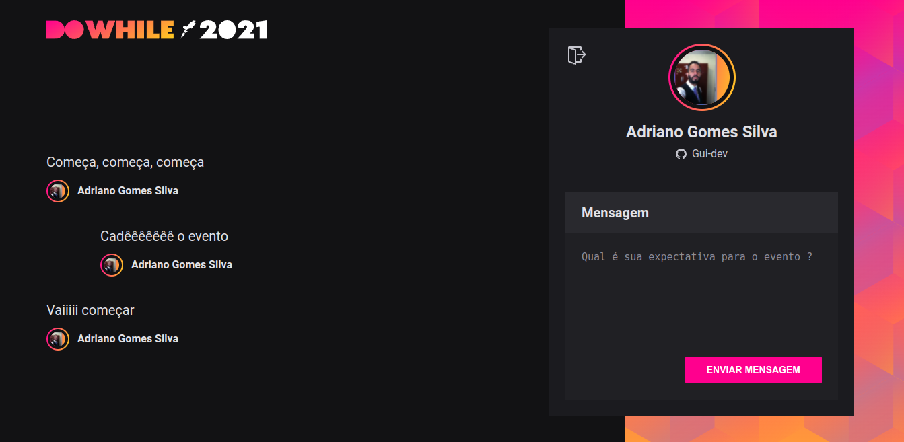

# NLW-Heat-React

## NLW - Heat - Rocketseat

Aplicação para o envio de mensagens :)

  
   
  

## Tecnologias

Esse projeto foi desenvolvido com as seguintes tecnologias:

- [Node.js](https://nodejs.org/en/)
- [React](https://reactjs.org)
- [Vite](https://vitejs.dev/guide/)
- [TypeScript](https://www.typescriptlang.org/)
- [Sass](https://sass-lang.com/)
- [Prisma](https://www.prisma.io/)
- [Socket.io](https://socket.io/)
- [OAuth - Github](https://oauth2.com/)

## Projeto

É uma aplicação facilita a interação nas lives/streams através de perguntas onde é necessário a autenticação com o github. A cada 3s a aplicação atualiza as perguntas feitas e exibem para o usuário.

## Para rodar o projeto:

  - Baixe ou clone esse repositório
  - [Baixe ou clone o repositório do backend](https://github.com/Gui-dev/node-heat)
  - Instale os módulos em ambos os repositórios: `npm install` ou `yarn`
  - No backend:
    - Rode: `npm run dev` ou `yarn dev`
  - No frontend:
    - Rode: `npm run dev` ou `yarn dev`
